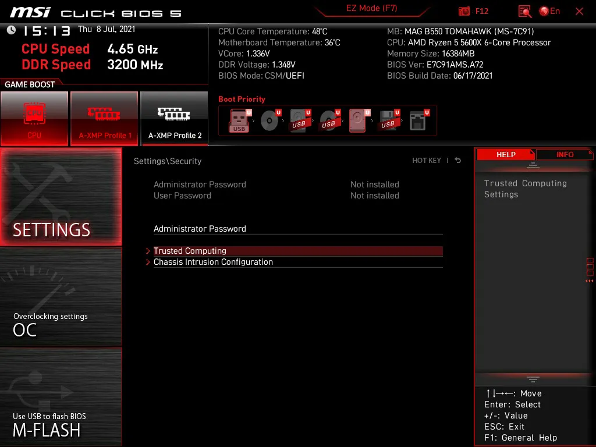
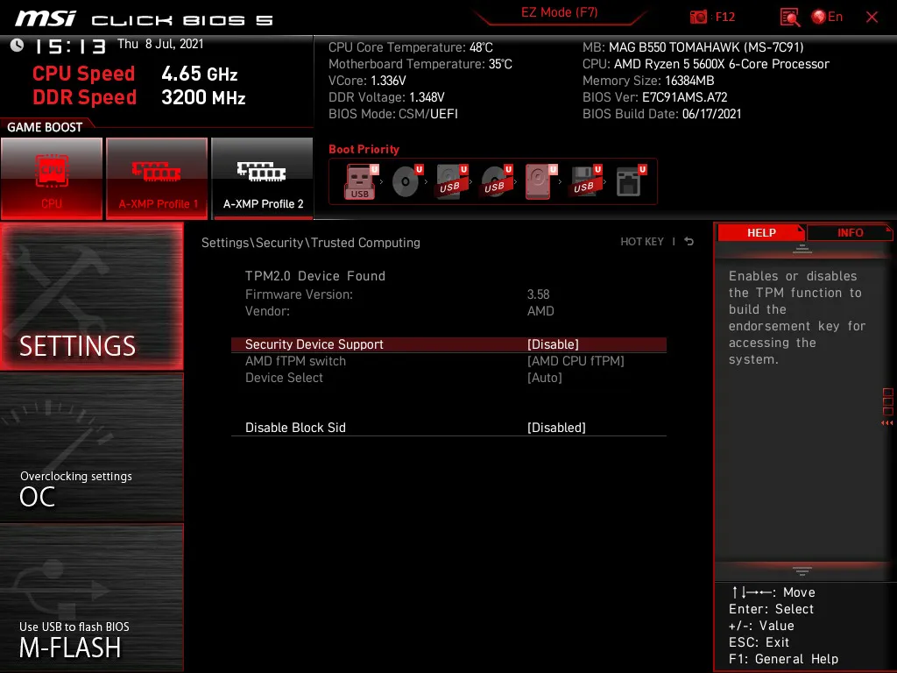
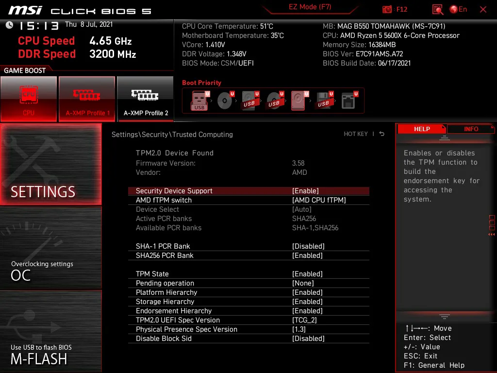

## Introduction
Trusted Platform Module is required for the next Windows 11
Windows 11 is planned to be launched this late 2021, a free update for everyone with Windows 10 users. one thing that requires attention is the requirement of TPM or Trusted Platform Module. luckily MSI B550 Tomahawk has a built-in TPM module but is disabled by default, here how to enable it.
Go to your bios, when turning your computer, smashing del button

## How to

If you get this screen, it means you are in EZ Mode, press f7 to go to Advance Mode.

Once you are in Advance Mode, go to Settings.

Go to Security.

Go to Trusted Computing.

Then enable the Security Device Support.

That’s it, restart your PC, you can now try it on Windows 11.

## Wrap Up
So Windows 11 will launch this late 2021, and TPM is one of the requirements. After enabling it on BIOS, you can try windows 11 on your PC.