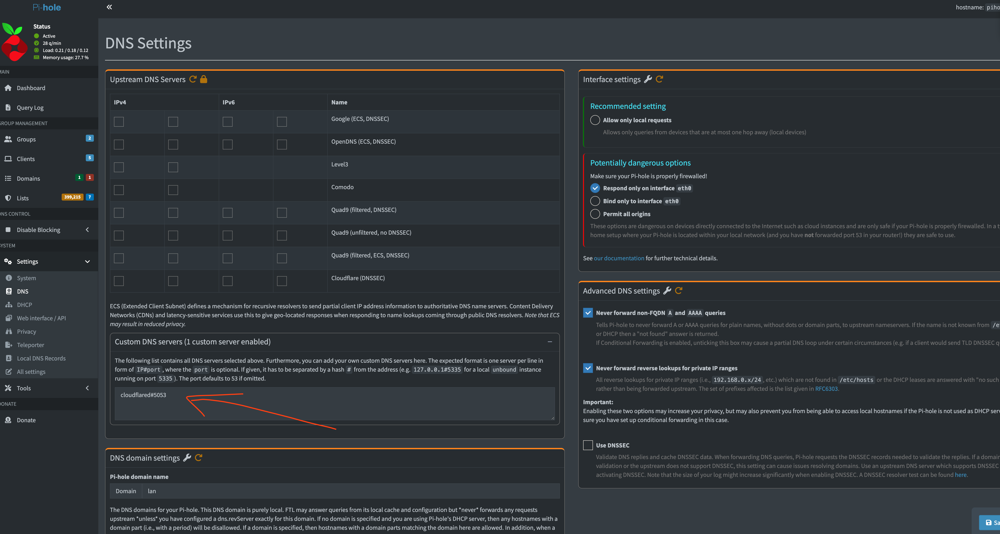

 on [Unsplash](https://unsplash.com/photos/a-bunch-of-blue-wires-connected-to-each-other-PSpf_XgOM5w?utm_content=creditCopyText&utm_medium=referral&utm_source=unsplash)")

DNS over HTTPS (DoH) is a protocol designed to enhance privacy and security by encrypting DNS queries using the HTTPS protocol. This prevents third parties, such as internet service providers (ISPs), from monitoring or tampering with DNS lookups. By encrypting DNS traffic, DoH ensures it blends in with regular web traffic, safeguarding it from surveillance and certain types of attacks. However, it does not conceal the destination IP address.

On the other hand, Pi-hole is a network-wide ad blocker that acts as a DNS sinkhole, blocking ads and trackers at the DNS level. It can be installed on various devices, including Raspberry Pi, and is often used in home networks to improve privacy and reduce unwanted content.

Combining Pi-hole with DoH enhances privacy by encrypting DNS queries while blocking ads and trackers at the network level. This integration ensures secure, private browsing by preventing interception and surveillance of DNS traffic.

# Docker

While Pi-hole's official documentation recommends installing cloudflared directly on the host system as outlined in their [DNS over HTTPS guide](https://docs.pi-hole.net/guides/dns/cloudflared/), this approach requires multiple installation steps and system-level configuration. Installing Pi-hole with Docker is significantly simpler and more streamlined. This guide will show you how to implement Cloudflare DoH with Pi-hole using Docker only, eliminating the complexity of host-level installations and providing a cleaner, more manageable setup.

```yaml
services:
  cloudflared:
    image: cloudflare/cloudflared:latest
    command: >
      proxy-dns
      --address 0.0.0.0
      --port 5053
      --upstream https://1.1.1.1/dns-query
      --upstream https://1.0.0.1/dns-query
      # or: --upstream https://family.cloudflare-dns.com/dns-query
    restart: unless-stopped
    networks: [dnsnet]

  pihole:
    image: pihole/pihole:latest
    environment:
      TZ: Asia/Jakarta
      WEBPASSWORD: "changeme"
      # Optional: set upstream via env so it persists across restarts
      FTLCONF_DNS_UPSTREAMS: "cloudflared#5053"
    volumes:
      - ./pihole/etc-pihole:/etc/pihole
      - ./pihole/etc-dnsmasq.d:/etc/dnsmasq.d
    ports:
      - "53:53/tcp"
      - "53:53/udp"
      - "80:80/tcp"
    depends_on:
      - cloudflared
    restart: unless-stopped
    networks: [dnsnet]

networks:
  dnsnet:
    driver: bridge

```

# Verification


Once you run `docker compose up -d`, it's important to verify that Pi-hole is correctly configured to use the cloudflared service. Access your Pi-hole admin interface (typically at `http://localhost/admin`) and navigate to **Settings > DNS**. In the "Upstream DNS Servers" section, ensure that the custom DNS server is set to `cloudflared#5053`. This configuration tells Pi-hole to forward DNS queries to the cloudflared container on port 5053, which will then encrypt and send them to Cloudflare's DoH endpoints. If the setting isn't automatically applied from the environment variable, you can manually configure it through the web interface.

# Conclusion
By following this guide, you have successfully set up Pi-hole to use Cloudflare's DNS over HTTPS (DoH) with Docker. This configuration enhances your network's privacy and security by encrypting DNS queries while effectively blocking ads and trackers at the DNS level. Enjoy a safer and cleaner browsing experience!

