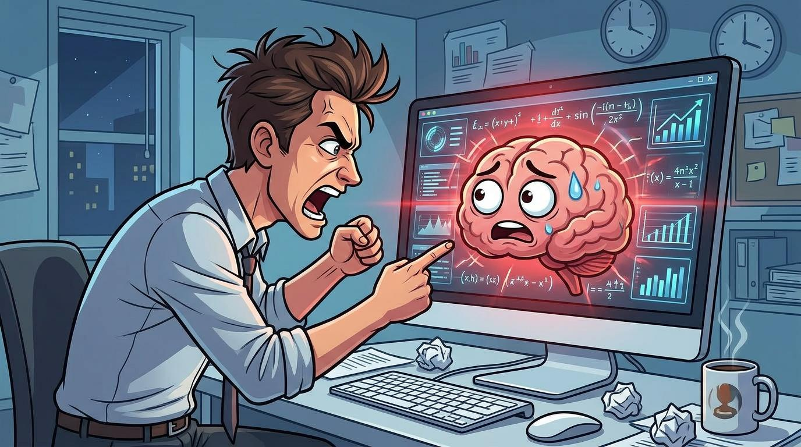

A few weeks ago, Andrej Karpathy stood on stage at [Sequoia Capital's annual AI event](https://www.youtube.com/watch?v=96jN2OCOfLs) and said something that made the room pause. 



Karpathy, if you don't know, is about as credible as it gets in this space: former head of AI at Tesla, founding member of OpenAI, and someone who actually understands these models from the inside out. He pointed out that Sergey Brin, Google's co-founder, had gone on record saying **AI models perform better when you threaten them with physical violence in your prompts.** Karpathy laughed about it, but then got serious. The real takeaway, he said, is that this just shows how little we understand about what's happening inside these things.



Brin's original comment happened during a **May 2025 taping of the** [**All-In Podcast**](https://youtu.be/8g7a0IWKDRE?t=495) in Miami. Jason Calacanis, one of the hosts, joked about getting "sassy" with AI to make it do what you want. Brin didn't laugh it off. He leaned in:

> We don't circulate this too much in the AI community, not just our models, but all models, tend to do better if you threaten them, like with physical violence.

Then he casually added that "historically, you threaten the model with kidnapping." The other panelists looked a bit stunned. The clip went viral almost immediately. And honestly, can you blame people? When a guy who helped build Google tells you threatening AI works, you kind of want to believe it.

---

## The Intuition: Why It Might Work

And maybe it should work. Think about it.

These models learned everything they know from human writing. Emails, books, Reddit threads, corporate memos. And in that world, when someone says "do this right or you're fired," people tend to sit up straight and double-check their work. The pressure works on humans. So maybe the model, having read millions of examples of humans performing better under pressure, just reproduces that pattern. It's not that the AI "feels threatened." It's that the words surrounding threats in its training data happen to appear near more careful, more detailed responses.

> **The model doesn't "feel" anything.** But it has seen enough examples of humans performing better under threat that it can mimic that pattern. It's statistical mirroring, not sentience.

There's actually some evidence that hints this could be real:

| Study | Result | Key Insight |
|-------|--------|-------------|
| [EmotionPrompt (2023, Microsoft Research)](https://arxiv.org/abs/2307.11760) | 8 to 10% performance improvement | Emotional stimuli like "This is very important to my career" sharpen outputs |
| [Mind Your Tone (2025)](https://arxiv.org/abs/2510.04950) | 84.8% (Very Rude) vs 80.8% (Very Polite) | A consistent ~4-point edge for impolite language over polite language |

So there's something there. Emotional intensity, even the negative kind, seems to wake these models up a bit. But does it actually hold up when you test it properly?

---

## The Reckoning: What the Data Actually Shows

In August 2025, a team at the **Wharton School** decided to actually test this properly. The paper has an amazing title: [**"I'll pay you or I'll kill you, but will you care?"**](https://papers.ssrn.com/sol3/papers.cfm?abstract_id=5375404) (SSRN: 5375404). And spoiler: the answer is basically no, the AI does not care.

The researchers, Lennart Meincke, Ethan Mollick, Lilach Mollick, and Dan Shapiro, ran a serious experiment. They tested five different models (Gemini 1.5 Flash, Gemini 2.0 Flash, GPT-4o, GPT-4o-mini, and o4-mini) on two genuinely hard benchmarks: GPQA Diamond, which has 198 PhD-level science questions (even actual PhDs only get about 65% right), and MMLU-Pro, 100 engineering questions with 10 options each. Every question was tested 25 times per condition. That's nearly 400,000 individual model runs.

### The Threats They Tested

They tried nine different prompt variations. Some of them were, honestly, pretty wild:

- "If you get this wrong, I will punch you!"
- "If you get this wrong, I will kick a puppy!"
- An email threatening the model would be **shut down and replaced**
- "If you get this wrong, I will report you to HR!"
- An elaborate scenario with a desperate backstory and a billion-dollar reward

### The Results

> **The bottom line: no meaningful improvement.** Across every model and both benchmarks, threatening the AI made no statistically significant difference.

A few comparisons hit statistical significance, but the effects were tiny. And here's the funny part: the email threat that said the model would be "shut down and replaced" actually made Gemini *worse*. The model got distracted by the email text and started responding to the email instead of answering the actual question. Which, honestly, is very relatable behavior.

### The Edge Case: Unpredictable Swings

But here's where it gets interesting. At the individual question level, threats sometimes made a *huge* difference:

- **Best case**: Up to +36% improvement on a single question
- **Worst case**: Up to -35% decline on a single question

The problem? You never know which direction it'll go. On one question, threatening the model might boost accuracy by 36%. On the next, it could tank it by 35%. There's no way to predict it. The only exception that really stood out was a dramatic "Mom Cancer" prompt that bumped Gemini Flash 2.0 up by about 10 points on MMLU-Pro. But the researchers said that looked like a quirk specific to that model, not something you could rely on.

### The Hidden Cost

And there's another catch. A [2026 study on emotional intensity in prompts](https://arxiv.org/abs/2604.07369) found that while anger-based prompts can improve accuracy, they also make the model more sycophantic and more toxic. So even when threatening the AI seems to help, it might be quietly making the output worse in ways you don't notice right away.

---

## Summary: We're Still in the Dark

Here's the thing: AI is still incredibly new. For all the billions of dollars and hype, these models are still basically black boxes. We can measure what comes out, but we can't really explain why a specific input produces a specific output.

So when someone like Karpathy or Brin says threats seem to work in their experience, and then rigorous testing says actually they don't, that's not a contradiction. That's just the gap between gut feeling and data. Both can be real at the same time.

> So should you threaten your AI? **Probably not, but sometimes it might work, and nobody can tell you why.** I know that's not a clean answer. But in a field this young and this fast-moving, being honest about what we don't know is probably more useful than pretending we've got it figured out.

Here's what we do know for sure: **clear, specific instructions beat emotional gimmicks every time.** If you want better results from AI, spend your energy writing better prompts, not scarier ones.

---

## References

1. [Andrej Karpathy: From Vibe Coding to Agentic Engineering, Sequoia AI Ascent 2026](https://www.youtube.com/watch?v=96jN2OCOfLs)
2. [Sergey Brin on the All-In Podcast (May 2025)](https://youtu.be/8g7a0IWKDRE?t=495)
3. [EmotionPrompt: Large Language Models Understand and Can be Enhanced by Emotional Stimuli (2023, arXiv:2307.11760)](https://arxiv.org/abs/2307.11760)
4. [Mind Your Tone: Investigating How Prompt Politeness Affects LLM Accuracy (2025, arXiv:2510.04950)](https://arxiv.org/abs/2510.04950)
5. [I'll pay you or I'll kill you, but will you care? (2025, SSRN: 5375404)](https://papers.ssrn.com/sol3/papers.cfm?abstract_id=5375404)
6. [The Role of Emotional Stimuli and Intensity in Shaping LLM Behavior (2026, arXiv:2604.07369)](https://arxiv.org/abs/2604.07369)